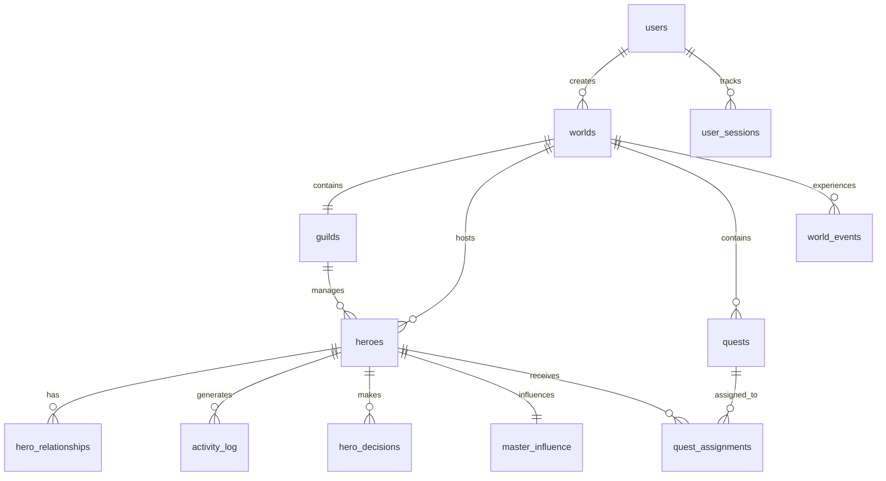

# Database Design Documentation

## Overview
The AI Hero Tycoon database is designed to support a persistent, AI-driven world where heroes continue to live and act even when players are offline. The schema uses PostgreSQL with JSONB for flexible data storage and advanced indexing for performance.

## Core Design Principles

### 1. **Persistent World State**
- All hero actions are logged with timestamps
- World continues to evolve with real-time tracking
- Offline progress is calculable from activity logs

### 2. **AI-First Architecture**
- JSONB fields store AI-generated content
- Flexible personality system with numerical traits
- Decision tracking for AI behavior analysis

### 3. **Relationship-Driven Gameplay**
- Complex hero relationship system
- Master influence tracking (Trust/Respect/Fear)
- Social dynamics affect gameplay decisions

### 4. **Scalable Performance**
- Strategic indexes for common queries
- Views for complex data aggregation
- Efficient JSONB usage for flexible data

## Table Relationships



## Key Tables Explained

### **heroes** - Core Hero System
- **Personality System**: 7 traits (0-100 scale) stored as JSONB
- **AI Integration**: Backstory and motivation from AI generation
- **Real-time State**: Current action, location, energy, mood
- **Constraints**: Validates personality values within bounds

**Key Indexes:**
- `idx_personality_gin`: GIN index for personality trait queries
- `idx_heroes_last_decision`: Optimizes AI decision scheduling
- `idx_heroes_current_action`: Fast action filtering

### **hero_relationships** - Social Dynamics
- **Relationship Types**: Friendship, rivalry, romantic, mentor
- **Strength Score**: -100 to +100 for relationship intensity
- **Event History**: JSONB array tracking relationship changes
- **Bi-directional**: Relationships exist between any two heroes

**Unique Features:**
- Prevents self-relationships with CHECK constraint
- Unique constraint per relationship type pair
- Tracks interaction frequency and recency

### **activity_log** - Complete Action History
- **Dual Time Tracking**: Real-time and game-world time
- **Flexible Data**: JSONB for any activity type
- **Resource Tracking**: Changes to gold, items, experience
- **Mood Impact**: How actions affect hero happiness

**Performance Features:**
- Partitioned by world_id for large datasets
- Multiple indexes for different query patterns
- Efficient for offline progress calculations

### **hero_decisions** - AI Decision System
- **Context Awareness**: What the hero was considering
- **Option Analysis**: All available choices stored
- **Reasoning**: AI-generated explanation of choice
- **Outcome Tracking**: Results and satisfaction rating

**AI Integration:**
- Stores personality factors that influenced decisions
- Links to activity_log for complete action history
- Enables AI behavior analysis and improvement

### **master_influence** - Player-Hero Relationship
- **Three-Pillar System**: Trust, Respect, Fear (0-100 each)
- **Historical Tracking**: JSONB array of influence changes
- **One-to-One**: Each hero has exactly one influence record
- **Gameplay Impact**: Affects hero compliance and happiness

## JSONB Data Structures

### Hero Personality
```json
{
  "courage": 75,
  "greed": 30,
  "loyalty": 85,
  "curiosity": 60,
  "ambition": 45,
  "patience": 70,
  "empathy": 80
}
```

### World Data (AI Generated)
```json
{
  "biomes": [
    {
      "type": "forest",
      "location": {"x": 0, "y": 0, "width": 100, "height": 100},
      "resources": ["wood", "herbs", "mystical_spring"],
      "monsters": ["wolf", "treant", "forest_sprite"],
      "difficulty": 2
    }
  ],
  "landmarks": [
    {
      "name": "Ancient Oak",
      "type": "mystical_tree",
      "location": {"x": 45, "y": 67},
      "effects": {"wisdom_bonus": 10}
    }
  ]
}
```

### Activity Data
```json
{
  "action": "train_combat",
  "location": "training_grounds",
  "skill_trained": "sword_fighting",
  "duration_minutes": 120,
  "effectiveness": 85,
  "partners": ["hero_uuid_123"]
}
```

## Performance Optimizations

### Indexing Strategy
1. **GIN Indexes**: On all JSONB columns for flexible queries
2. **Composite Indexes**: For common multi-column filters
3. **Partial Indexes**: On active/current state records only
4. **Time-based Indexes**: For efficient offline progress queries

### Query Optimization
- **Views**: Pre-computed complex joins (active_heroes, recent_activity)
- **Functions**: PostgreSQL functions for common calculations
- **Partitioning**: Large tables partitioned by world_id
- **Connection Pooling**: Efficient database connection management

### Scalability Considerations
- **Read Replicas**: For analytics and reporting queries
- **Sharding**: By world_id for horizontal scaling
- **Archive Strategy**: Move old activity_log entries to separate tables
- **Cache Layer**: Redis for frequently accessed game state

## Data Integrity

### Constraints
- **Foreign Keys**: Cascade deletes maintain referential integrity
- **Check Constraints**: Validate personality traits and scores
- **Unique Constraints**: Prevent duplicate relationships and assignments
- **NOT NULL**: Critical fields cannot be empty

### Triggers
- **Updated At**: Automatically update timestamp fields
- **Activity Logging**: Auto-log certain hero state changes
- **Relationship Updates**: Maintain bi-directional relationship consistency
- **Influence Recalculation**: Update master influence on hero actions

## Migration Strategy

### Version Control
- **Sequential Migrations**: Numbered SQL files for schema changes
- **Rollback Scripts**: Down migrations for each change
- **Environment Parity**: Same schema across dev/staging/production
- **Backup Strategy**: Full backups before major migrations

### Data Evolution
- **JSONB Flexibility**: Easy to add new fields without migrations
- **Backwards Compatibility**: Old data structures supported
- **Progressive Enhancement**: New features work with existing data
- **Testing**: Migration testing on production-like datasets

## Security Measures

### Access Control
- **Row Level Security**: Users can only access their worlds
- **API Layer**: Database access only through authenticated API
- **Connection Security**: SSL/TLS encrypted connections
- **Audit Logging**: Track sensitive data access

### Data Protection
- **Password Hashing**: bcrypt with salt for user passwords
- **API Key Encryption**: Sensitive configuration encrypted at rest
- **PII Handling**: Minimal personal information storage
- **GDPR Compliance**: User data deletion capabilities

This database design supports the complex, AI-driven gameplay while maintaining performance and scalability for a persistent online world where heroes truly live independently of player presence.